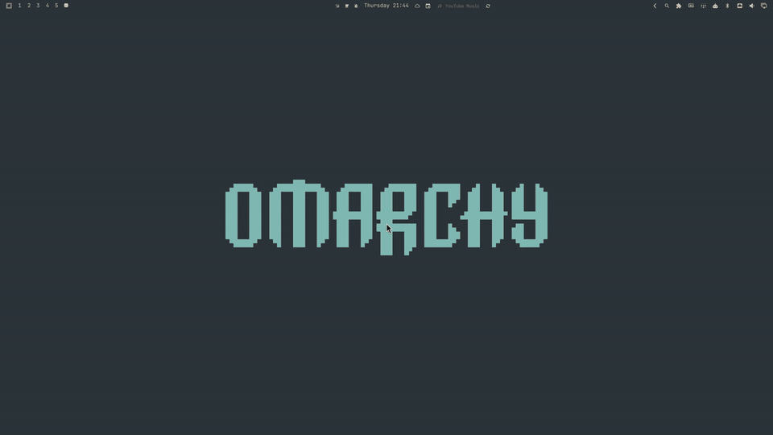

# Omarchy Find

A fast, elegant, keyboard-driven universal file search and quick launcher for the [Omarchy](https://github.com/basecamp/omarchy) shell on Linux.


---

## Demo

https://github.com/user-attachments/assets/771820df-2a80-4e5d-9aee-1f0e7b9f1159

### AI Search Mode



Type `ai <question>` to stream an answer from your already-installed agent CLI, then press `Enter` to continue the *exact same* conversation in a terminal — no replay, no separate chat history. Full-quality captures per agent: [Claude Code](media/ai-demo-claude.mp4) · [Codex](media/ai-demo-codex.mp4) · [Antigravity](media/ai-demo-agy.mp4).

---

## About

**Omarchy Find** brings a modern, Spotlight/Raycast-inspired search overlay experience natively integrated into the Omarchy shell. Designed for speed, ergonomics, and seamless workflow, it enables you to summon a search overlay at any moment to find and access anything across your system with zero friction.

Whether you are looking for deeply nested project files, academic papers and PDFs, media collections, or config directories (such as `~/.config/hypr`, `~/.config/omarchy`, `nvim`, etc.), Omarchy Find indexes and filters your filesystem in real time using `fd`.

Beyond simple file launching, it acts as a central productivity hub:
- **Instant Access:** Open any file or folder directly with its default application (`xdg-open`).
- **File Manager Integration:** Reveal and jump directly into the enclosing directory (`Alt+Enter`).
- **Terminal Integration:** Spawn your preferred terminal directly inside the target directory (`Ctrl+T`).
- **Clipboard Utility:** Instantly copy clean absolute paths to the clipboard (`Ctrl+C`).
- **Web Search:** Type `go <terms>` to seamlessly perform an instant Google search in your default browser.
- **AI Search Mode:** Type `ai <question>` to stream an answer from your installed Claude Code, Codex, or Antigravity CLI right in the overlay, then press `Enter` to resume the exact same session in a terminal.

---

## Features

- **Blazing Fast Search:** Powered by `fd` with smart multi-term matching and relevance ranking (exact and prefix matches prioritized over fuzzy subsequences).
- **Full-Path Awareness:** Matches both filenames and parent folder structures (e.g. typing `config` or `hypr` accurately locates `~/.config/hypr`).
- **Type Filters:**
  - **All:** Search everything across your home directory with user files prioritized.
  - **Folders:** Non-hidden user directories in `$HOME`.
  - **System Folders:** Essential editable configuration and dotfile directories (`~/.config`, `hypr`, `omarchy`, `nvim`, `kitty`, etc.) with noise and caches excluded.
  - **Documents:** PDFs, Markdown, Word, eBooks, spreadsheets, and text files.
  - **Images, Videos & Audio:** Quick discovery for multimedia assets.
  - **Code:** Source files and scripts across all major programming languages.
- **Instant Sorting Modes:** Switch on the fly between **Relevance**, **Most Recent**, **Oldest**, **Name (A → Z)**, and **Name (Z → A)** via single click or `Ctrl+S`.
- **Quick Web Search:** Type `go <query>` to hide local file lists and open Google search directly in your browser.
- **AI Search Mode:** Type `ai <question>` to get a streamed one-shot answer from your existing agent CLI (Claude Code by default; Codex and Antigravity also supported), with no API keys managed by this plugin — it's a thin frontend over whichever CLI you already have authenticated. `Enter` after the answer completes resumes the exact same agent session in a terminal, with no replay of your original prompt.
- **Ergonomic Keyboard Navigation:** Full support for arrow keys, readline navigation (`Ctrl+N`/`Ctrl+P`), vim-style shortcuts (`Ctrl+J`/`Ctrl+K`), `Home`/`End`, and `PageUp`/`PageDown`.
- **Status Bar Widget & CLI:** Includes a bar magnifier icon widget, a launcher desktop entry, and the `omarchy-find` CLI command.
- **Native Shell Aesthetics:** Automatically follows active Omarchy themes, colors, and typography.
- **Noise Filtering:** Automatically ignores noisy build directories (`.git`, `node_modules`, `.cache`, `.venv`, electron storages, trash, etc.).

---

## Install

```sh
omarchy plugin add https://github.com/jesseburlamaque/omarchy-find.git --enable
omarchy restart shell
```

> **Tip (Optional):** To assign the global keyboard shortcut (`Alt + Space`) and enable the `omarchy-find` command in your terminal, run:
> ```sh
> ~/.config/omarchy/plugins/jesseburlamaque.omarchy-find/bin/omarchy-find setup-keybind
> ```
> *(Or pass a custom shortcut, e.g. `... setup-keybind "SUPER + F"`)*

---

## Usage

You can summon Omarchy Find in four convenient ways:

1. **Status Bar Widget**: Click the magnifier icon (`󰍉`) on the Omarchy top bar.
2. **Application Launcher**: Open the Omarchy app launcher and click **Find**.
3. **Global Keyboard Shortcut (`Alt + Space`)**: Press `Alt + Space` to summon or dismiss the search overlay anywhere (configured during install or via `~/.config/hypr/bindings.lua`).
4. **CLI / Terminal**:
   - `omarchy-find` — Toggle the search overlay.
   - `omarchy-find open '{"query":"notes"}'` — Open with a pre-filled query.
   - `omarchy-find remove-keybind` — Remove shortcut from Hyprland.

### In-App Keyboard Shortcuts

| Shortcut | Description |
| -------- | ----------- |
| `Type` | Search files, folders and paths in real time |
| `go <query>` | Instant Google Search in default browser |
| `ai <question>` | Stream an answer from your agent CLI; `Enter` again resumes the same session in a terminal |
| `↑ / ↓` | Navigate up / down through results |
| `Ctrl+N / Ctrl+P` | Readline-style next / previous item navigation |
| `Ctrl+J / Ctrl+K` | Vim-style next / previous item navigation |
| `PageUp / PageDown` | Scroll page up / down (6 items) |
| `Home / End` | Jump to first / last result |
| `Tab` | Cycle through type filters |
| `Ctrl+S` | Cycle through sort modes (Relevance, Recent, Oldest, A-Z, Z-A) |
| `Ctrl+L` or click count | Cycle result display limit thresholds (15, 30, 60, 100, 200) |
| `Enter` or click | Open selected file or folder with default application |
| `Alt+Enter` | Open enclosing folder in default file manager |
| `Ctrl+C` | Copy absolute file/folder path to clipboard (`wl-copy`) |
| `Ctrl+T` | Open terminal at selected item's directory |
| `Ctrl+W` / `Ctrl+Backspace` | Delete previous word in search input |
| `Ctrl+U` | Clear entire search query |
| `Esc` | Clear query if typed, or close overlay if query is empty |

### AI Search Mode

Type `ai <question>` to ask your already-installed, already-authenticated agent CLI a question:

```text
ai explain why my systemd user service isn't starting
```

The answer streams into the overlay as it's generated. Once it finishes, press `Enter` again to open a terminal that resumes the *exact same* agent conversation — nothing is replayed, and no chat history is invented by this plugin. `Esc` at any point cancels the request and no agent process is left running.

Supported agents: **Claude Code** (default), **Codex**, and **Antigravity** (`agy`). Omarchy Find never manages API keys or does its own inference — it only shells out to whichever CLI is already configured on your machine.

To change the agent or tune streaming behavior, create `~/.config/omarchy-find/ai.json` (this file is optional and is never created automatically):

```json
{
  "agent": "claude",
  "model": null,
  "prefix": "ai ",
  "maxAnswerRows": 6,
  "drainBaseCps": 60,
  "streamFlushMs": 16
}
```

See `share/ai.json.example` for a copy of the same defaults. `agent` is one of `claude`, `codex`, or `agy`; `model` overrides the CLI's default model when set; `prefix` changes the trigger word from `ai `. `streamFlushMs` is how often the streamed answer redraws (default 16ms/60Hz, for a smooth continuous reveal); `drainBaseCps` is the minimum reveal speed in characters/second for a thin trickle of text — bursts from the CLI always reveal faster than this on their own.

---

## Enable / Disable

You can manage the plugin through the Omarchy menu:

```sh
omarchy > menu >  Enable Plugin > Omarchy Find
omarchy > menu >  Disable Plugin > Omarchy Find
```

Or use the CLI:

```sh
omarchy plugin enable jesseburlamaque.omarchy-find
omarchy plugin disable jesseburlamaque.omarchy-find
```

After enabling or disabling, restart the shell:

```sh
omarchy restart shell
```

## Update

```sh
omarchy plugin update jesseburlamaque.omarchy-find --yes
omarchy restart shell
```

## Uninstall

1. Remove the plugin from Omarchy shell:
```sh
omarchy plugin remove jesseburlamaque.omarchy-find
omarchy restart shell
```

2. (Optional) If you configured the global shortcut and CLI, remove them:
```sh
omarchy-find remove-keybind
rm -f ~/.local/bin/omarchy-find ~/.local/share/applications/omarchy-find.desktop
```
*(Or manually delete the `omarchy-find` line from `~/.config/hypr/bindings.lua`)*

---

## Feedback & Contributions

This project is a work in progress — suggestions, bug reports, and improvements are very welcome!

---

## License

MIT
