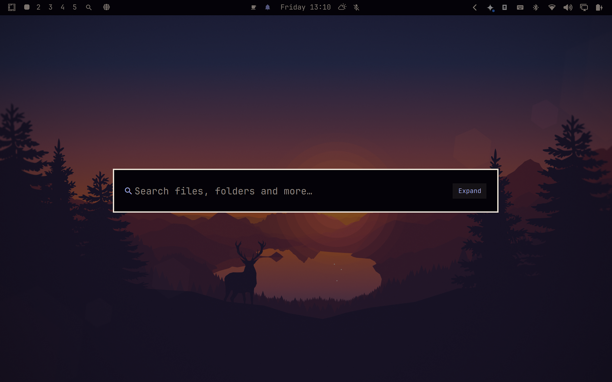

# Omarchy Find

A fast, elegant, keyboard-driven universal file search and quick launcher for the [Omarchy](https://github.com/basecamp/omarchy) shell on Linux.



---

## Demo

https://github.com/user-attachments/assets/771820df-2a80-4e5d-9aee-1f0e7b9f1159

---

## About

**Omarchy Find** brings a modern, Spotlight/Raycast-inspired search overlay experience natively integrated into the Omarchy shell. Designed for speed, ergonomics, and seamless workflow, it enables you to summon a search overlay at any moment to find and access anything across your system with zero friction.

Whether you are looking for deeply nested project files, academic papers, media collections, or config directories (such as `~/.config/hypr`, `omarchy`, `nvim`), Omarchy Find indexes and filters your filesystem in real time. Beyond file launching, it acts as a central productivity hub: opening items in default applications, revealing folders in your file manager, launching terminals in target directories, copying clean paths, and bridging desktop search with AI and web queries.

---

## Features

- **Blazing Fast Search:** Real-time indexing powered by `fd` with smart multi-term matching and automatic noise filtering (`.git`, `node_modules`, `.cache`, `.venv`, electron storages, trash, etc.).
- **Full-Path Awareness:** Matches both filenames and parent folder structures (e.g. typing `config` or `hypr` accurately locates `~/.config/hypr`).
- **Smart Type Categorization:** Dedicated filters for All files, Non-hidden Folders, System Folders (configs & dotfiles), Documents, Multimedia, and Code.
- **Dynamic Sorting & Results Limits:** On-the-fly reordering (Relevance, Recent, Oldest, A-Z, Z-A) and customizable display limits.
- **AI & Web Search Hub:** Query your preferred local AI coding agent (`ai <query>`) or jump directly to Google search (`go <query>`).
- **Native Shell Aesthetics:** Automatically follows active Omarchy themes, colors, and typography, with status bar widget and CLI integration.

👉 *See [Usage](#usage) for summon options and the complete keyboard shortcuts guide.*

---

## AI Search Mode

Type `ai <question>` in the search overlay to stream answers from your preferred AI coding agent directly inside the overlay. Press `Enter` to continue the conversation in a full terminal session, `Ctrl+C` to copy the response, or `Esc` to cancel.

### Automatic Agent Detection

By default, Omarchy Find automatically detects and uses the default AI agent configured in your Omarchy system (`~/.config/omarchy/defaults/agent`).

| Omarchy Default Agent | AI Search Mode Status |
|---|---|
| **Antigravity** (`agy`) | ✅ Fully supported (automatic streaming & terminal handoff) |
| **OpenCode** (`opencode`) | ✅ Fully supported (automatic streaming & terminal handoff) |
| **Claude Code** (`claude`) | ✅ Fully supported (automatic streaming & terminal handoff) |
| **Codex** (`codex`) | ✅ Fully supported (automatic streaming & terminal handoff) |

#### Setting the Omarchy Default Agent

You can set your default agent using the Omarchy CLI or directly via shell:

- **Set to Antigravity (`agy`):**
  ```sh
  echo "agy" > ~/.config/omarchy/defaults/agent
  ```
- **Set to OpenCode (`opencode`):**
  ```sh
  echo "opencode" > ~/.config/omarchy/defaults/agent
  ```
  *(Or via `omarchy default agent opencode`)*

Omarchy Find hot-reloads this change live in real time without requiring a shell restart.

---

### Configuring an Agent Override (`ai.json`)

If you wish to use a different agent specifically inside Omarchy Find (for example, using **Antigravity** for fast desktop searches while keeping OpenCode as your primary terminal coding agent), you can create an override file in `~/.config/omarchy-find/ai.json`:

```json
{
  "agent": "agy"
}
```

> **Note:** Any `"agent"` value defined in `ai.json` acts as an **explicit override** and takes precedence over `~/.config/omarchy/defaults/agent`.

#### Available Fields (All Optional)

```json
{
  "agent": "agy",          // "agy" | "opencode" | "claude" | "codex"
  "model": null,           // Override model string (e.g. "opencode-go/qwen3.8-flash") or null for CLI default
  "prefix": "ai ",         // Trigger prefix in the overlay
  "maxAnswerRows": 6       // Maximum visible answer lines before scrolling
}
```

The plugin hot-reloads config changes live without requiring a shell restart.

### Returning to the System Default Agent (Removing Override)

If you previously edited `ai.json` manually and want Omarchy Find to go back to following your Omarchy default agent (`~/.config/omarchy/defaults/agent`):

- **Delete the override file:**
  ```sh
  rm ~/.config/omarchy-find/ai.json
  ```
- **Or remove the `"agent"` key:** Keep other custom fields (like `"prefix"`) in `ai.json` but delete the `"agent"` line.

Omarchy Find will immediately detect the change and resume using whichever agent is configured in `~/.config/omarchy/defaults/agent`.

---

## Install

```sh
omarchy plugin add https://github.com/jesseburlamaque/omarchy-find.git --enable
omarchy restart shell
```

> **Tip (Optional):** To assign the global keyboard shortcut (`Alt + Space`) and enable the `omarchy-find` command in your terminal, run:
> ```sh
> ~/.config/omarchy/plugins/jesseburlamaque.omarchy-find/bin/omarchy-find setup-keybind
> ```
> *(Or pass a custom shortcut, e.g. `... setup-keybind "SUPER + F"`)*

---

## Usage

You can summon Omarchy Find in four convenient ways:

1. **Status Bar Widget**: Click the magnifier icon (`󰍉`) on the Omarchy top bar.
2. **Application Launcher**: Open the Omarchy app launcher and click **Find**.
3. **Global Keyboard Shortcut (`Alt + Space`)**: Press `Alt + Space` to summon or dismiss the search overlay anywhere (configured during install or via `~/.config/hypr/bindings.lua`).
4. **CLI / Terminal**:
   - `omarchy-find` — Toggle the search overlay.
   - `omarchy-find open '{"query":"notes"}'` — Open with a pre-filled query.
   - `omarchy-find remove-keybind` — Remove shortcut from Hyprland.

### In-App Keyboard Shortcuts

| Shortcut | Description |
| -------- | ----------- |
| `Type` | Search files, folders and paths in real time |
| `go <query>` | Instant Google Search in default browser |
| `↑ / ↓` | Navigate up / down through results |
| `Ctrl+N / Ctrl+P` | Readline-style next / previous item navigation |
| `Ctrl+J / Ctrl+K` | Vim-style next / previous item navigation |
| `PageUp / PageDown` | Scroll page up / down (6 items) |
| `Home / End` | Jump to first / last result |
| `Tab` | Cycle through type filters |
| `Ctrl+S` | Cycle through sort modes (Relevance, Recent, Oldest, A-Z, Z-A) |
| `Ctrl+L` or click count | Cycle result display limit thresholds (15, 30, 60, 100, 200) |
| `Enter` or click | Open selected file or folder with default application |
| `Alt+Enter` | Open enclosing folder in default file manager |
| `Ctrl+C` | Copy absolute file/folder path to clipboard (`wl-copy`) |
| `Ctrl+T` | Open terminal at selected item's directory |
| `Ctrl+W` / `Ctrl+Backspace` | Delete previous word in search input |
| `Ctrl+U` | Clear entire search query |
| `Esc` | Clear query if typed, or close overlay if query is empty |

---

## Enable / Disable

You can manage the plugin through the Omarchy menu:

```sh
omarchy > menu >  Enable Plugin > Omarchy Find
omarchy > menu >  Disable Plugin > Omarchy Find
```

Or use the CLI:

```sh
omarchy plugin enable jesseburlamaque.omarchy-find
omarchy plugin disable jesseburlamaque.omarchy-find
```

After enabling or disabling, restart the shell:

```sh
omarchy restart shell
```

## Update

```sh
omarchy plugin update jesseburlamaque.omarchy-find --yes
omarchy restart shell
```

## Uninstall

1. Remove the plugin from Omarchy shell:
```sh
omarchy plugin remove jesseburlamaque.omarchy-find
omarchy restart shell
```

2. (Optional) If you configured the global shortcut and CLI, remove them:
```sh
omarchy-find remove-keybind
rm -f ~/.local/bin/omarchy-find ~/.local/share/applications/omarchy-find.desktop
```
*(Or manually delete the `omarchy-find` line from `~/.config/hypr/bindings.lua`)*

---

## Feedback & Contributions

This project is a work in progress — suggestions, bug reports, and improvements are very welcome!

---

## License

MIT
